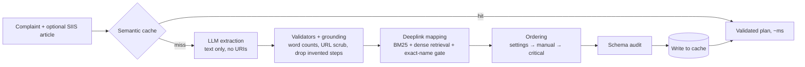

# Smart Guided Troubleshooting Engine

Turns vague smartphone complaints ("my screen went black") into validated, ordered troubleshooting plans where every Settings step is **one tap away** through an exact deeplink, in under 300 ms for questions seen before.

 

## Results

| Metric | Target | Ours |
| :--- | :--- | :--- |
| Schema-valid outputs | ≥ 99% | 100% |
| URL leaks | 0 | 0 |
| Auto actions with a deeplink | ≥ 90% | 100% |
| Cache hit P95 (exact / unseen paraphrase) | ≤ 300 ms | 0.1 ms / 39 ms |
| Hit rate on 60 unseen paraphrases | ≥ 80% | 86% (0 wrong plans) |
| Cold path P95 | ≤ 8 s | _see metrics.md_ |

Full report: [metrics.md](metrics.md)

## Architecture



## Quick start

```bash
git clone <this repo> && cd smart-troubleshooting-engine
python -m venv venv && source venv/bin/activate      # Windows: venv\Scripts\activate
pip install -r requirements.txt
cp .env.example .env                                  # add an LLM key, or leave it empty for offline mode
uvicorn app.main:app --port 8000
```

Open http://127.0.0.1:8000 for the demo console, or http://127.0.0.1:8000/docs for interactive API docs.

Docker: `docker build -t troubleshoot-engine . && docker run -p 8000:8000 --env-file .env troubleshoot-engine`

## API

```bash
curl -X POST http://127.0.0.1:8000/v1/troubleshoot \
  -H "Content-Type: application/json" \
  -d '{"query": "phone screen fully cracked"}'
```

`GET /health` returns `{"status": "ok"}` once the model, index and cache are loaded (503 while starting).

## Design decisions

- **The LLM never touches deeplinks.** It only restructures article text. URIs are masked tokens, so code picks them from the catalog; hallucinated URIs are impossible by construction.
- **Rules are enforced by code, not prompts.** Word counts, Title Case, goal syntax and URL removal are validated and auto-fixed after every LLM call.
- **Grounding check.** Every step must trace back to the article; the LLM adding "Release the buttons." (not in the article) is caught and dropped.
- **Exact-screen matching.** Retrieval proposes candidates, but a word-order-aware name gate accepts an entry only if its setting name matches a screen named in the steps. Without it, the top retrieval result was a decoy for 13 of 19 actions in our ablation.
- **Safe cache.** A paraphrase is served only if it's close to one plan *and* clearly closer than any other; near-ties fall back to the full pipeline instead of guessing.

## Findings

- The official `sample_output.json` violates the 5–7 word description rule, and Appendix B uses `bixby://` while the catalog uses `voiceassist://`.
- Several complaints are paired with unrelated articles; the engine answers `no_match` rather than inventing a plan.
- The catalog contains misleading messages and non-phone entries (TV, refrigerator), which are handled explicitly.

## Reproduce

```bash
python -m pytest -q
python -m scripts.run_phase1          # LLM extraction      -> outputs/phase1_results.jsonl
python -m scripts.run_phase2          # deeplinks + order   -> outputs/phase2_results.jsonl
python -m scripts.warm_cache --rebuild
python -m scripts.benchmark_cache     # latency + unseen paraphrase hit rate
python -m scripts.run_results         # final outputs/results.jsonl
python -m scripts.benchmark_cold      # full-pipeline latency
python -m scripts.ablation
python -m scripts.make_metrics        # writes metrics.md
```

## Project structure

```
app/
  main.py            REST API          engine.py        cache → pipeline → write-through
  schema.py          official schema   config.py        every tunable in one place
  pipeline/          extraction, validators, grounding, categories, deeplink index/mapper, ordering
  cache/             semantic cache    retrieval/       embeddings
  llm/               client + prompt   static/          demo console
scripts/             phase runners, benchmarks, metrics generator
tests/               117 tests
data/                catalog, SIIS articles, inputs, held-out paraphrases
```

## Team

- **Rayasam Amarnath:** architecture; LLM extraction, validators and grounding; deeplink retrieval, mapping and ordering; semantic cache and engine; benchmarks, metrics and documentation.
- **Neeraj Prasad:** REST API, demo console, Docker deployment, and end-to-end API, stress and cold-path test scripts.

## Demo & Presentation

- **Demo video:** [Watch on YouTube](<your-video-link>)
- **Presentation:** [docs/Smart_Guided_Troubleshooting_Engine.pptx](docs/Smart_Guided_Troubleshooting_Engine.pptx) ([PDF](docs/Smart_Guided_Troubleshooting_Engine.pdf))

## Run with Docker

```bash
docker build -t smart-troubleshooting-engine .
docker run -p 8000:8000 --env-file .env smart-troubleshooting-engine
```

Then open http://127.0.0.1:8000 (demo console) or http://127.0.0.1:8000/docs (API docs).
The image includes CPU-only PyTorch and the embedding model, so it starts without downloading anything.

## AI Usage Disclosure

- **Inside the engine:** `openai/gpt-oss-120b` (via Groq) extracts plans from SIIS articles; `BAAI/bge-small-en-v1.5` produces embeddings for retrieval and the semantic cache.
- **During development:** the code, documentation and presentation were developed with substantial help from an AI assistant (Claude by Anthropic). All code was run, tested and validated by the team.