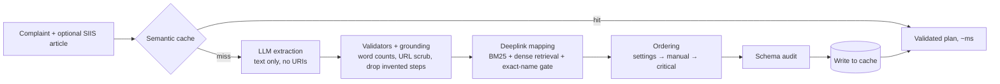

# Smart Guided Troubleshooting Engine

Turns vague smartphone complaints ("my screen went black") into validated, ordered troubleshooting plans where every Settings step is **one tap away** through an exact deeplink, in under 300 ms for questions seen before.

  

## Demo & Presentation

- **Demo video:** [Watch the demo video](https://drive.google.com/drive/folders/14zz6nUbW4QdiiqaZ6nSY1Qao3EycsSfe?usp=drive_link)
- **Presentation:** [PowerPoint](docs/Smart%20Guided%20Troubleshooting%20Engine.pptx) · [PDF](docs/Smart%20Guided%20Troubleshooting%20Engine.pdf)

## The Problem

Customers describe phone problems in their own words ("my screen inputs are delayed and laggy"). Today, a support agent reads long knowledge-base articles, picks and orders the right steps by hand, and the customer then hunts through nested Settings menus alone. That takes about **15 minutes per complaint**, across millions of interactions.

## What It Does

1. A customer's complaint (plus, for a new problem, its SIIS help article) is sent to the API.
2. If the question, or anything that means the same, was answered before, the **semantic cache** returns the validated plan in milliseconds at zero cost.
3. Otherwise, the LLM extracts the steps from the article, and **code** validates every rule, drops any step not found in the article, attaches the exact Settings deeplink to each action, and orders the plan from least to most disruptive.
4. The app shows a checklist where each Settings step opens the exact screen with one tap, and a validation link confirms the setting actually changed.

## Results

| Metric | Target | Ours |
| :--- | :--- | :--- |
| Schema-valid outputs | ≥ 99% | 100% (20/20) |
| URL leaks | 0 | 0 |
| Auto actions with a deeplink | ≥ 90% | 100% |
| Cache hit P95 (exact / unseen paraphrase) | ≤ 300 ms | 0.1 ms / 39 ms |
| Hit rate on unseen paraphrases | ≥ 80% | 86% (0 wrong plans, 0 false hits) |
| Cold path P95 (full pipeline) | ≤ 8 s | 6.0 s |
| Problems in 160 concurrent HTTP requests | 0 | 0 |

Full report: [metrics.md](metrics.md)

## Architecture



## How to Run the Demo

### 1. Set up (one time, about 5 minutes)

```bash
git clone https://github.com/Rayasam3/smart-troubleshooting-engine.git
cd smart-troubleshooting-engine
python -m venv venv
venv\Scripts\activate                 # macOS/Linux: source venv/bin/activate
pip install -r requirements.txt
copy .env.example .env                # macOS/Linux: cp .env.example .env
```

Open `.env` and add a Groq API key (`LLM_API_KEY=gsk_...`, free at console.groq.com).
**No key?** Set `LLM_PROVIDER=offline` and the engine uses its built-in rule-based extractor instead.

### 2. Build the plans and the cache (first run only)

```bash
python -m scripts.run_phase1          # reads the 20 complaints and their articles
python -m scripts.run_phase2          # attaches deeplinks and orders actions
python -m scripts.warm_cache --rebuild
```

### 3. Start the engine

```bash
uvicorn app.main:app --port 8000
```

The first start takes about 20 seconds while the embedding model loads; `/health` answers
`503 starting` until it is ready, then `200 ok`.

### 4. Walk through the demo

Open **http://127.0.0.1:8000** (the demo console).

| Step | What to do | What you will see |
| :--- | :--- | :--- |
| 1 | Click the sample **"phone screen fully cracked"** | A plan in milliseconds, marked **cache HIT**, cost $0, even though this wording was never seen before |
| 2 | Click **"My X1 responds late to my taps…"** | 8 numbered actions: teal **AUTO** settings first (each with a deeplink), amber **MANUAL** checks next, red **CRITICAL** steps like factory reset last |
| 3 | Type a new complaint, e.g. *"My phone screen will not turn sideways when I watch videos"*, paste the article (command below) into the second box, click **Build** | The full pipeline runs (about 3 to 6 seconds): **cache miss**, model name and cost shown, then a validated plan |
| 4 | Clear both boxes, type *"screen stuck in portrait, won't rotate"*, click **Build** | The same plan instantly from the cache, because it means the same thing |
| 5 | Try something unrelated with no article, e.g. *"my smartwatch strap snapped"* | An empty plan with `no_siis_context`: the engine never invents an answer |

To get the article text for step 3:

```bash
python -c "import json;r=[x for x in json.load(open('data/siis_responses.json',encoding='utf-8'))['responses'] if x['id']=='row_20'][0];print(r['siis_response']['content'])"
```

### 5. Explore the API

Open **http://127.0.0.1:8000/docs**, expand `POST /v1/troubleshoot`, click **Try it out**, and send:

```json
{"query": "fold x1 half screen black"}
```

Or from a terminal:

```bash
curl -X POST http://127.0.0.1:8000/v1/troubleshoot \
  -H "Content-Type: application/json" \
  -d '{"query": "phone screen fully cracked"}'
```

`GET /health` returns `{"status": "ok"}` once the model, index and cache are loaded (503 while starting).

### 6. Check the numbers yourself

```bash
python -m pytest -q                   # 100 automated tests
python -m scripts.benchmark_cache     # cache latency and unseen-paraphrase hit rate
python -m scripts.stress_test         # run while the server is up: 160 concurrent requests
```

## Run with Docker

```bash
docker build -t smart-troubleshooting-engine .
docker run -p 8000:8000 --env-file .env smart-troubleshooting-engine
```

Then open http://127.0.0.1:8000 (demo console) or http://127.0.0.1:8000/docs (API docs).
The image includes CPU-only PyTorch and the embedding model, so it starts without downloading anything.

## Design Decisions

- **The LLM never touches deeplinks.** It only restructures article text. URIs are masked tokens, so code picks them from the catalog; hallucinated URIs are impossible by construction.
- **Rules are enforced by code, not prompts.** Word counts, Title Case, goal syntax and URL removal are validated and auto-fixed after every LLM call.
- **Grounding check.** Every step must trace back to the article; the LLM adding "Release the buttons." (not in the article) is caught and dropped.
- **Exact-screen matching.** Retrieval proposes candidates, but a word-order-aware name gate accepts an entry only if its setting name matches a screen named in the steps. Without it, plain top-1 retrieval picked a screen the steps never name for 5 of 7 settings actions in our ablation.
- **Safe ordering.** Settings toggles first, physical checks next, disruptive steps (restart → safe mode → factory reset) always last.
- **Safe cache.** A paraphrase is served only if it's close to one plan *and* clearly closer than any other; near-ties fall back to the full pipeline instead of guessing.

## Findings

- The official `sample_output.json` violates the 5–7 word description rule, and Appendix B uses `bixby://` while the catalog uses `voiceassist://`.
- Several complaints are paired with unrelated articles; the engine answers `no_match` rather than inventing a plan.
- The catalog contains misleading messages and non-phone entries (TV, refrigerator, air conditioner), which are handled explicitly.
- The LLM's output varies slightly between runs even at temperature 0; the cache makes repeated and paraphrased questions fully deterministic.

## Troubleshooting

- **`extraction_error` for every complaint:** the LLM API is unreachable, or the key is wrong or rate-limited. Check `LLM_API_KEY`, or use `LLM_PROVIDER=offline`.
- **`CERTIFICATE_VERIFY_FAILED` on a company network:** the network's security proxy blocks Python's HTTPS. Use a personal network, or offline mode with `EMBEDDING_BACKEND=tfidf`.
- **Groq rate limits:** the free tier allows 8,000 tokens per minute and 200,000 per day; wait and retry.

## Reproduce All Results

```bash
python -m pytest -q
python -m scripts.run_phase1          # LLM extraction      -> outputs/phase1_results.jsonl
python -m scripts.run_phase2          # deeplinks + order   -> outputs/phase2_results.jsonl
python -m scripts.warm_cache --rebuild
python -m scripts.benchmark_cache     # latency + unseen paraphrase hit rate
python -m scripts.run_results         # final outputs/results.jsonl
python -m scripts.benchmark_cold      # full-pipeline latency
python -m scripts.ablation
python -m scripts.make_metrics        # writes metrics.md
```

## Project Structure

```
app/
  main.py            REST API          engine.py        cache → pipeline → write-through
  schema.py          official schema   config.py        every tunable in one place
  pipeline/          extraction, validators, grounding, categories, deeplink index/mapper, ordering
  cache/             semantic cache    retrieval/       embeddings
  llm/               client + prompt   static/          demo console
scripts/             phase runners, benchmarks, metrics generator
tests/               100 automated tests
data/                catalog, SIIS articles, inputs, held-out paraphrases
docs/                presentation (PPTX + PDF)
outputs/             final results and benchmark reports
```

## AI Usage Disclosure

- **Inside the engine:** `openai/gpt-oss-120b` (via Groq) extracts plans from SIIS articles; `BAAI/bge-small-en-v1.5` produces embeddings for retrieval and the semantic cache.
- **During development:** the code, documentation and presentation were developed with substantial help from an AI assistant (Claude by Anthropic). All code was run, tested and validated by the team.

## Team

- **Rayasam Amarnath:** architecture; LLM extraction, validators and grounding; deeplink retrieval, mapping and ordering; semantic cache and engine; benchmarks, metrics and documentation.
- **Neeraj Prasad:** REST API, demo console, Docker deployment, and end-to-end API, stress and cold-path test scripts.